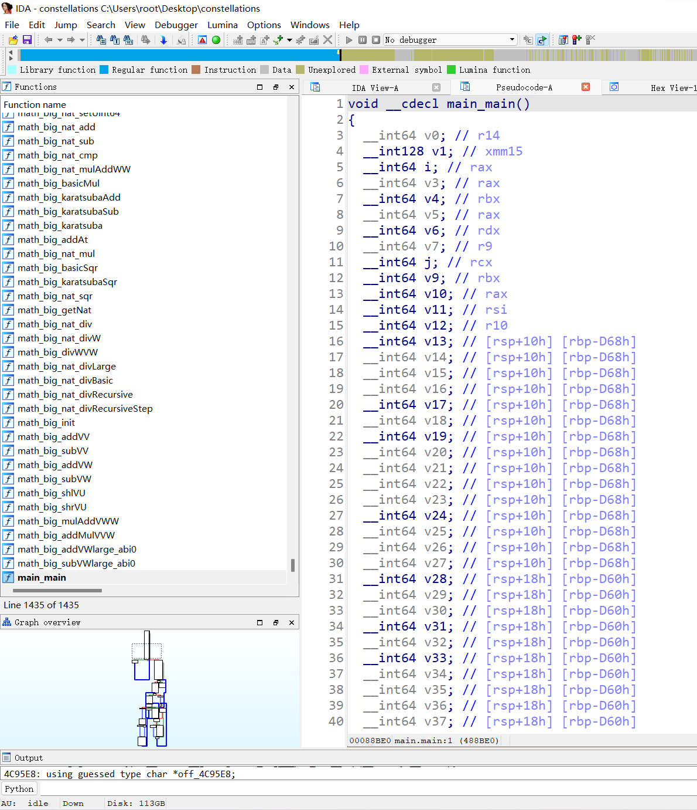
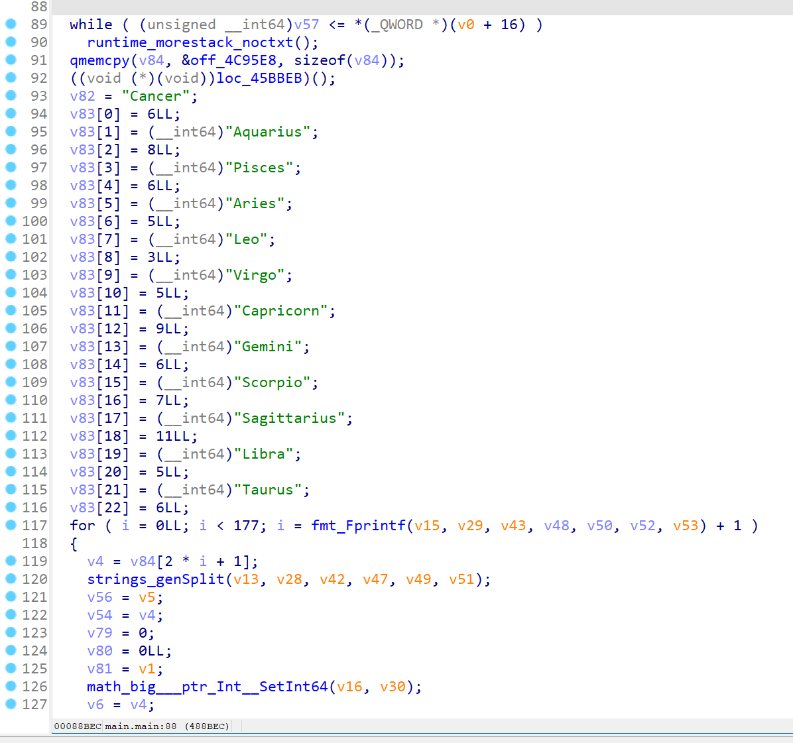
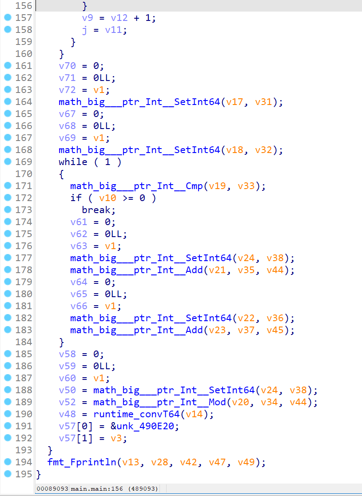
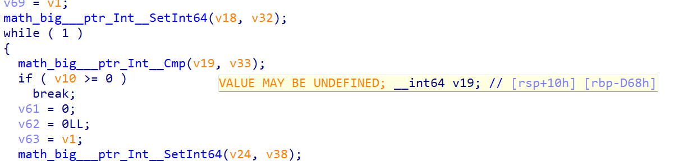
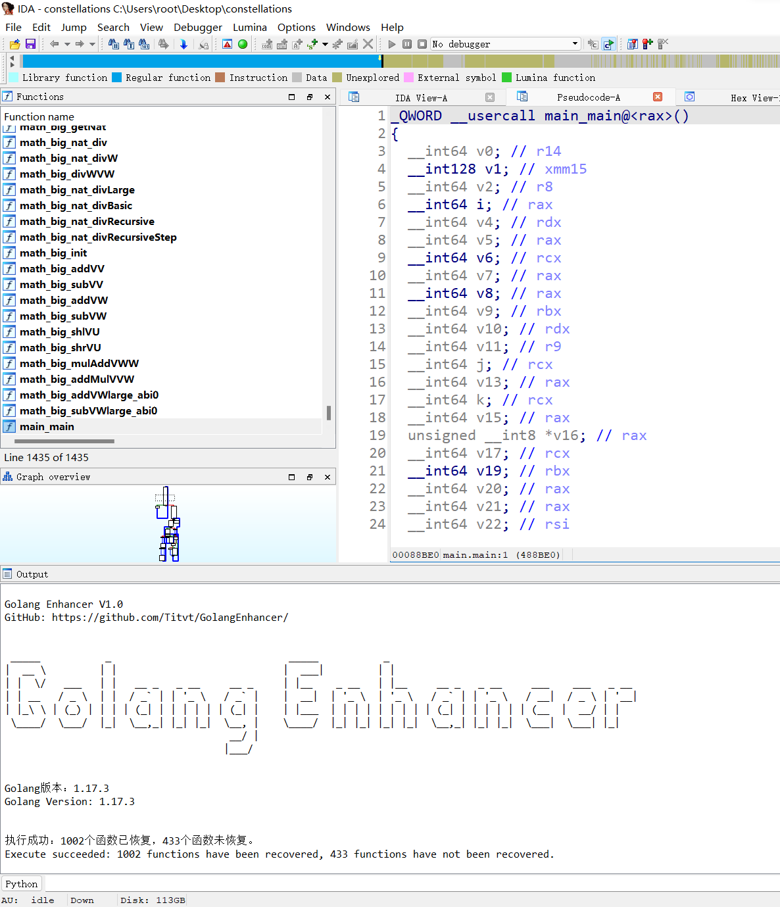
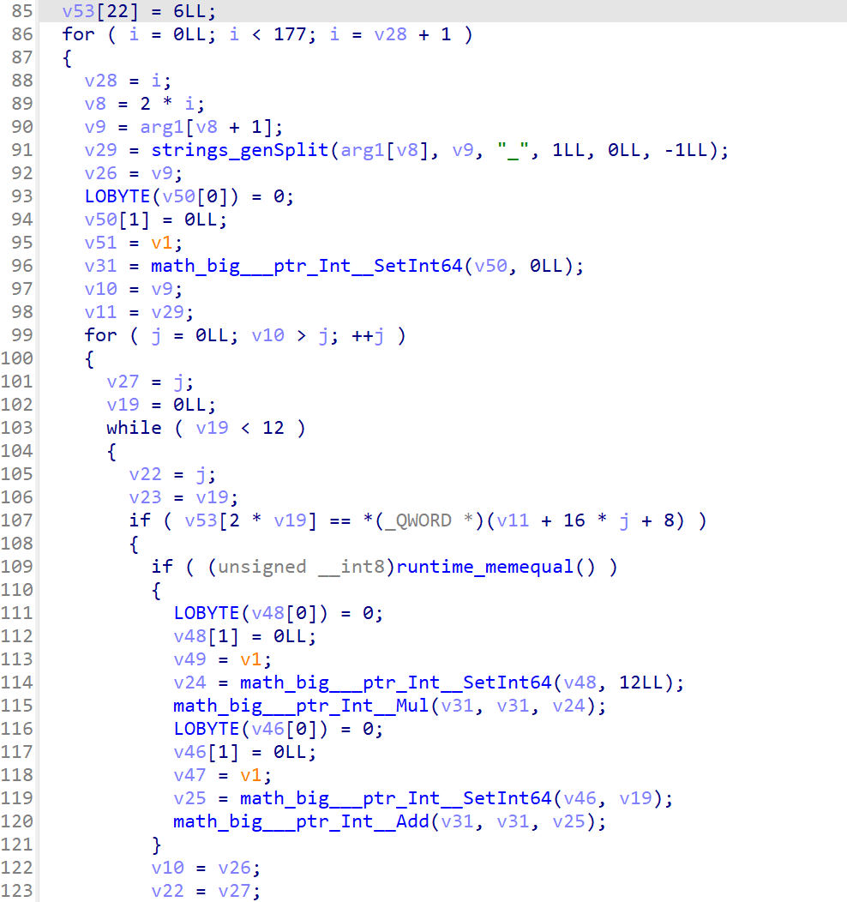

# Golang Enhancer

    Author: Titvt （古月浪子）
    Version: 1.0

## Environment Requirement

- IDA Pro 7.6 with IDAPython
- Python 3

## Installation

Copy `golang_enhancer.py` to `%IDA_ROOT%/plugins/` folder.

## Usage

1. Open a Golang program with IDA.
2. Wait for analyzing until IDA comes to idle status.
3. Press `Ctrl+Alt+G` hotkey or click `Edit->Plugins->Golang Enhancer` menu to execute the script.
4. All functions are recovered now.

## FAQ

### Q: Why it fails when executing script?

A: Maybe the program is not a Golang program, or it has been stripped symbols.

### Q: Some functions have not been recovered?

A: Golang Enhancer calculates the number of parameters depending on `runtime.morestack` function, so it cannot recover a function without calling it.

### Q: Will Golang Enhancer support non-symbol Golang program in the future?

A: Yes.

## Example

> SECCON CTF 2021 - Reverse - constellations

It is a Golang program with symbols.

We can see many orange variables, IDA tells us the value may be undefined.

That is because Golang has its own calling convention, which is different from normal x64 calling convention.

Golang uses rax, rbx, rcx, rdi, rsi, r8, r9, r10, r11 to pass the first 9 parameters, so IDA cannot recognize the correct parameters when a call instruction appears.

It is difficult to read such a mess!

Now we run Golang Enhancer.

After less than a second, it executes successfully.

These calls seem to have been recovered with correct parameters, we are able to directly analyze codes now.

And the number of stack variables is also reduced from 86 to 55. It means some junk variables are optimized by Golang Enhancer.
